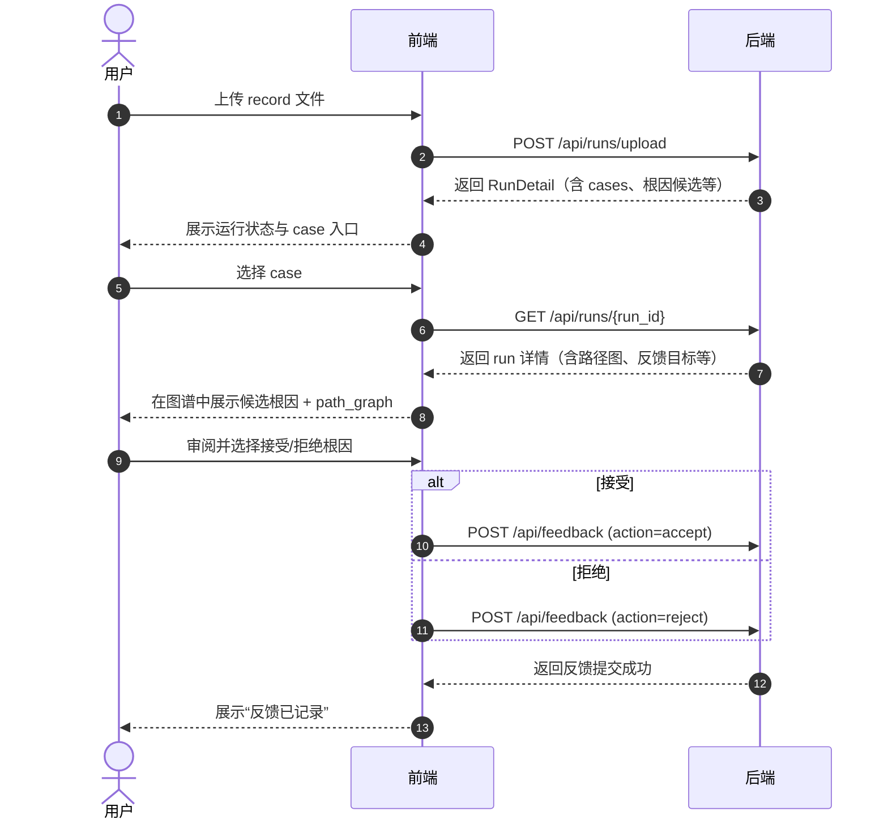

# RootLens 前端页面布局重构设计文档

> 更新时间：2026-05-15
> 适用范围：`/evidence`、`/graphs`、`/materials`
> 文档定位：本轮页面布局重构评审稿，直接围绕当前主流程、图谱素材管理和 RCA 审阅展开。
> 说明：本文按最新评审意见重写页面命名、主辅区结构和线框图，作为下一步前端重构的直接依据。

## 1. 重构目标

1. 让用户能顺畅完成这条主链路：`上传 record 文件 -> 查看运行状态 -> 选择 case -> 图谱中审阅候选根因与路径 -> accept / reject -> 看到“反馈已记录”`。
2. 将三页统一收敛为：`证据与审阅`、`图谱探索`、`图谱工坊`。
3. 新增独立的图谱素材管理工作流，支持素材 CRUD、简单筛选排序、批量构图。
4. 所有页面取消 `sticky` 辅区，但保留位于主区右边的常驻辅区；另外新增一个独立的右侧悬浮 hover 信息框，作为后续扩展位。
5. 整体设计保持简单明了、实用优先、卡片排布工整，不做实验室式复杂分栏。

## 2. 设计依据

本文基于以下上下文：

- `src/doc/system-design.md`
  RootLens 是多源工业 RCA 的探索性工作台，前端要强调图谱、证据和人工审阅之间的闭环。
- `src/doc/module-3-rca-engine.md`
  当前前端主要消费 `cases[]`、`ranked_root_causes`、`path_graph`、`review_targets`。
- `src/doc/frontend_handoff.md`
  当前分析主链路接口是 `POST /api/runs/upload`、`GET /api/runs`、`GET /api/runs/{run_id}`、`POST /api/feedback`。
- 最新后端 handoff 变更
  已新增图谱生成素材 CRUD，因此图谱工坊不能继续只做 source/build 实验页，而要升级为完整素材资产页。

## 3. 主流程映射

### 3.1 主链路



### 3.2 页面职责映射

| 步骤 | 页面 | 核心动作 | 结果 |
|---|---|---|---|
| 0 | `/materials` 图谱工坊 | 管理图谱素材、编辑、删除、排序筛选、批量构图 | 得到可用图谱资产 |
| 1 | `/evidence` 证据与审阅 | 上传 `record`，查看后端运行状态与进度 | 得到当前 run |
| 2 | `/evidence` 证据与审阅 | 选择 case，联动 evidence 列表 | 锁定当前分析上下文 |
| 3 | `/graphs` 图谱探索 | 查看总图谱、path_graph 子图、根因列表、反馈卡 | 完成 case 审阅 |
| 4 | `/graphs` 图谱探索 | 提交 accept / reject 反馈 | 返回“反馈已记录” |

### 3.3 导航顺序

建议导航顺序调整为：

1. `证据与审阅`（路由仍为 `/evidence`）
2. `图谱探索`（路由仍为 `/graphs`）
3. `图谱工坊`（路由仍为 `/materials`）

原因：

- 主链路从上传 run 开始，优先级最高。
- 图谱探索是主分析页，应紧接证据与审阅。
- 图谱工坊是资产准备与维护页，次于日常分析主路径。

## 4. 全局布局规范

### 4.1 工作台骨架

```text
┌──────────────────────────────────────────────────────────────────────────────┐
│ Top Bar 56                                                                  │
│ RootLens | 当前图谱 | 当前 Run / Case | 数据源模式 | 用户偏好                │
├──────────────┬───────────────────────────────────────────────────────────────┤
│ Left Nav     │ Compact Page Header 96                                       │
│ 220px        │ 页面标题 | 一句话说明 | 3 个关键指标 | 1 个主操作             │
│              ├───────────────────────────────────────────────────────────────┤
│ 证据与审阅   │ Main Content                                                  │
│ 图谱探索     │ 主区左、常驻辅区右，页面最右再外挂 hover 信息框               │
│ 图谱工坊     │ 内容区独立滚动                                               │
└──────────────┴───────────────────────────────────────────────────────────────┘
```

### 4.2 主区比例

桌面端内容区保持“主舞台 + 右侧常驻辅区”的基础结构，另外在页面最右侧外挂一个 hover 信息框。

建议宽度：

- 内容区最大宽度：`1480px`
- 主舞台：`920px ~ 1040px`
- 右侧常驻辅区：`320px ~ 380px`
- 右侧 hover 信息框展开宽度：`260px ~ 320px`
- 右侧 hover 信息框收缩宽度：`48px ~ 64px`
- 内容区间距：`24px`

说明：

- 主舞台和常驻辅区共同构成正文布局，辅区依旧位于主区右边。
- hover 信息框不替代常驻辅区，只作为额外信息挂件。
- 常驻辅区不使用 `sticky`，随页面内容自然排布。

### 4.3 右侧辅区与 hover 信息框规则

三页统一采用两层右侧结构：

- 第一层：常驻辅区
  - 固定出现在主区右边
  - 承担当前页面的核心二级信息和操作
  - 不做 `sticky`
- 第二层：hover 信息框
  - 挂在页面最右缘
  - 默认收缩为窄条
  - `hover` 后展开
  - 只放补充信息、说明、告警、统计或快捷提示

移动端：

- 常驻辅区下沉到主区下方
- hover 信息框改为底部抽屉或浮层入口

### 4.4 卡片语法

统一保留四类卡片：

- `Summary Card`：数量、状态、进度、时间。
- `List Card`：run、case、root cause、materials、evidence 列表。
- `Detail Card`：当前选中对象详情。
- `Action Card`：上传、保存、删除、构图、反馈。

统一规则：

- 卡片弱阴影、浅边框、纯白底。
- 页面首屏只保留一个主按钮组。
- 不使用“Tab 套 Tab”。
- 高级动作折叠，不和主流程同权。

## 5. 页面一：`/materials` 图谱工坊

### 5.1 页面定位

图谱工坊是图谱素材资产页，不再是实验台式的 build/review 标签集合。

主流程改为：

`筛选素材 -> 排序定位 -> 选中素材 -> 编辑 / 删除 -> 批量构图 -> 查看构图结果`

### 5.2 页面布局

```text
┌──────────────────────────────────────────────────────────────────────────────┐
│ 页面头：图谱工坊 | 当前默认图谱 | 素材总数 | 最近构图时间 | [上传素材]        │
├──────────────────────────────────────────────────────────────────────────────┤
│ 主舞台                                            │ 右侧常驻辅区            │
│                                                  │                          │
│ ┌─筛选与排序组─────────────────────────────────┐ │ ┌─上传 / 新建素材──────┐ │
│ │ 搜索 | 数据集 | 模态 | 状态 | 排序字段 | 升降序 │ │ │ 上传文件 / 名称 / 保存 │ │
│ └─────────────────────────────────────────────┘ │ ├─当前选中素材────────┤ │
│                                                  │ │ 摘要 / 预览 / 删除    │ │
│ ┌─素材列表─────────────────────────────────────┐ │ ├─构图配方────────────┤ │
│ │ □ 名称      类型   角色   数据集   更新时间   │ │ │ 已选素材 / 输出名    │ │
│ │ □ nodes.csv graph  node   tep     10:24      │ │ │ 场景 / [生成图谱]    │ │
│ │ □ edges.csv graph  edge   tep     10:24      │ │ └─────────────────────┘ │
│ │ □ records... seq   source mvtec   09:52      │ │                          │
│ └─────────────────────────────────────────────┘ │                          │
│                                                  │                          │
│ ┌─构图结果 / 已生成图谱────────────────────────┐ │                          │
│ │ 图谱名 | 来源素材数 | 节点/边 | 状态 | 操作   │ │                          │
│ │ RCA Graph A | 4 | 120/256 | 成功 | 设为默认  │ │                          │
│ │ RCA Graph B | 6 | 148/302 | 构建中 | 查看详情│ │                          │
│ └─────────────────────────────────────────────┘ │                          │
├──────────────────────────────────────────────────────────────────────────────┤
│ 页面最右侧 hover 信息框（默认收缩，hover 展开）                               │
│ 最近失败原因 / 素材提示 / 构图统计 / 使用说明                                  │
└──────────────────────────────────────────────────────────────────────────────┘
```

### 5.3 本页新增要求

必须新增一组简单筛选和排序控件：

- 筛选
  - 数据集
  - 模态
  - 状态
- 排序
  - 按更新时间
  - 按名称
  - 按类型
  - 升序 / 降序

这组控件固定放在素材列表上方，保持轻量，不做高级查询面板。

### 5.4 卡片设计

- `筛选与排序组`
  页面首层工具条，信息密度高，但必须保持单行可扫读。
- `素材列表卡`
  主舞台，优先表格视图。
- `构图结果卡`
  显示最新图谱构建产物和状态。
- `右侧常驻辅区`
  放上传、新建、当前选中素材、构图配方。
- `hover 信息框`
  只放补充说明、统计、告警和提示，不承载主操作。

### 5.5 交互要求

- `Create`
  支持上传文件创建和手动新建素材记录。
- `Read`
  支持搜索、筛选、排序、预览。
- `Update`
  支持修改名称、数据集、模态、角色、备注。
- `Delete`
  支持单条删除和批量删除，均二次确认。
- `Build`
  支持多选素材后直接生成图谱，并可一键设为默认图谱。

## 6. 页面二：`/evidence` 证据与审阅

### 6.1 页面定位

证据与审阅承担主流程第一站：

`上传 run -> 看后端运行状态和进度 -> 选中 run / case -> 查看 evidence`

本页不再把 run 列表、evidence 和复杂编辑拆成多个松散区块，而是围绕“上传与运行”做一体化组织。

### 6.2 页面布局

```text
┌──────────────────────────────────────────────────────────────────────────────┐
│ 页面头：证据与审阅 | 当前图谱 | 当前 run | case 总数 | [上传 record]         │
├──────────────────────────────────────────────────────────────────────────────┤
│ 主舞台                                            │ 右侧常驻辅区            │
│                                                  │                          │
│ ┌─上传与运行状态────────────────────────────────┐ │ ┌─Evidence 筛选────────┐ │
│ │ 左：上传区                                   │ │ │ 图谱筛选 | Run 筛选   │ │
│ │ 文件选择 | 数据集 | top_k | [上传并生成 Run] │ │ ├─Evidence 列表────────┤ │
│ │ 右：运行状态列表                             │ │ │ obs_id | facet | hint │ │
│ │ run_id | 阶段 | 进度 | 状态 | case_count    │ │ │ confidence | 来源      │ │
│ │ run_001 | parsing | 35% | running | 12      │ │ ├─当前 Evidence 摘要───┤ │
│ │ run_002 | ranking | 80% | running | 12      │ │ │ linked hints / raw refs│ │
│ │ run_003 | done    |100% | success | 8       │ │ │ time window / case     │ │
│ └─────────────────────────────────────────────┘ │ └───────────────────────┘ │
│                                                  │                          │
│ ┌─当前 Run 下的 Case 审阅表────────────────────┐ │                          │
│ │ case | dataset | evidence_count | top1 根因  │ │                          │
│ │ 路径数 | 反馈状态 | [图谱探索]               │ │                          │
│ │ Case 01 | tep | 8 | Valve A | 5 | 进入      │ │                          │
│ │ Case 02 | mvtec | 4 | Scratch B | 3 | 进入  │ │                          │
│ └─────────────────────────────────────────────┘ │                          │
├──────────────────────────────────────────────────────────────────────────────┤
│ 页面最右侧 hover 信息框（默认收缩，hover 展开）                               │
│ 当前图谱说明 / 数据质量提醒 / 快捷提示 / evidence 统计                         │
└──────────────────────────────────────────────────────────────────────────────┘
```

### 6.3 关键调整

- 上传区和运行列表合并到同一张主卡里。
- 运行列表只显示：
  - `run_id`
  - 后端阶段
  - 当前进度
  - 运行状态
  - case 数量
- 运行列表不再承担大段详情展示。
- case 选择入口放到主舞台下方的 `Case 审阅表`，保持主流程清晰。
- evidence 放在主区右边的常驻辅区，作为当前上下文情报面板。
- 页面最右侧额外挂一个 hover 信息框，后续可放补充说明、告警和统计。

### 6.4 卡片设计

- `上传与运行状态卡`
  左右一体化组织。左侧上传，右侧只展示状态和进度。
- `Case 审阅表卡`
  主舞台第二层，承担 case 选择和跳转。
- `Evidence 常驻辅区`
  展示 evidence 过滤器和 evidence 列表，不承担主操作。
- `hover 信息框`
  作为额外信息位，供后续扩展。

### 6.5 交互要求

- 上传成功后自动高亮最新 run。
- 点击运行状态列表中的某条 run，会加载该 run 的 case 表和 evidence 右侧辅区。
- evidence 辅区支持基于：
  - 当前图谱
  - 当前 run
  - facet
  - 关键字
  做快速过滤。
- 点击 `图谱探索` 后跳转到：
  - `/graphs?run_id={run_id}&case_id={case_id}`

## 7. 页面三：`/graphs` 图谱探索

### 7.1 页面定位

图谱探索是 RCA 审阅主舞台。页面聚焦三件事：

1. 看总图谱。
2. 看 path_graph 子图与当前反馈。
3. 在右侧根因列表中切换候选并提交反馈。

### 7.2 页面布局

```text
┌──────────────────────────────────────────────────────────────────────────────┐
│ 页面头：图谱探索 | 当前图谱 | 当前 run / case | 数据集 | [返回证据与审阅]    │
├──────────────────────────────────────────────────────────────────────────────┤
│ 主舞台                                            │ 右侧常驻辅区            │
│                                                  │                          │
│ ┌─总图谱───────────────────────────────────────┐ │ ┌─紧凑上下文────────────┐ │
│ │ 工具条：缩放 / 重置 / 图层切换 / 高亮候选    │ │ │ Graph | Run | Case     │ │
│ │                                              │ │ │ 反馈状态 | claim bound │ │
│ │          Total Graph / Knowledge Graph       │ │ ├─根因列表──────────────┤ │
│ │                                              │ │ │ #1 Candidate A 0.92    │ │
│ └─────────────────────────────────────────────┘ │ │ #2 Candidate B 0.81    │ │
│                                                  │ │ #3 Candidate C 0.74    │ │
│ ┌───────────────────────┬─────────────────────┐ │ │ click => 高亮图谱       │ │
│ │ path_graph 子图        │ 反馈卡               │ │ └───────────────────────┘ │
│ │ 仅显示当前 case 路径    │ 当前目标：候选 / 路径│ │                          │
│ │ 与总图谱联动高亮        │ accept / reject     │ │                          │
│ │                       │ note textarea        │ │                          │
│ │                       │ [提交反馈]           │ │                          │
│ │                       │ 反馈结果：已记录/... │ │                          │
│ └───────────────────────┴─────────────────────┘ │                          │
├──────────────────────────────────────────────────────────────────────────────┤
│ 页面最右侧 hover 信息框（默认收缩，hover 展开）                               │
│ 图谱统计 / provenance 摘要 / 风险提示 / 快捷说明                              │
└──────────────────────────────────────────────────────────────────────────────┘
```

### 7.3 关键调整

- 原来的独立上下文条不再单独占据主区顶部。
- 紧凑上下文被收进右侧常驻辅区顶部。
- 右侧常驻辅区只放两部分：
  - 紧凑上下文
  - 根因列表
- 页面最右侧额外挂一个 hover 信息框，用于后续补充信息。
- 首屏主舞台改为两层：
  - 第一层：总图谱
  - 第二层：左 `path_graph` 子图，右反馈卡
- 反馈结果直接集成进反馈卡，不再拆独立结果卡。

### 7.4 卡片设计

- `总图谱卡`
  全页第一视觉重心，用来承载完整图谱浏览。
- `path_graph 子图卡`
  位于总图谱下方左侧，只显示当前 case 的解释子图。
- `反馈卡`
  位于总图谱下方右侧，包含反馈输入和反馈结果。
- `根因列表常驻辅区`
  作为候选切换入口，不再承载其它复杂信息。
- `hover 信息框`
  作为额外补充信息位，后续可挂 provenance、统计和快捷说明。

### 7.5 交互要求

- 从 `/evidence` 进入本页时带上 `run_id` 与 `case_id`。
- 选择某个根因后：
  - 总图谱高亮相关节点和边。
  - `path_graph` 子图同步切换到该根因的解释路径。
  - 反馈卡默认目标切换到当前根因。
- 点击 `接受` 或 `拒绝` 后，调用 `POST /api/feedback`。
- 提交成功后，反馈卡底部直接显示：
  - `反馈已记录`
  - 最近动作
  - 提交时间
  - 提交人

### 7.6 关于 feedback target 的兼容策略

如果最新 handoff 已经打通 `root_cause_candidate` 反馈，则：

- 反馈卡直接对候选根因提交 accept / reject。

如果后端仍有 target type 枚举缺口，则：

- UI 仍保持“对候选根因反馈”的交互。
- 前端提交层可临时映射到兼容 target，不改页面布局。

## 8. 跨页状态同步

三个页面必须共享以下状态：

- `activeGraphId`
- `activeRunId`
- `activeCaseId`
- `activeCandidateId`
- `activePathId`

同步规则：

- 在 `图谱工坊` 设为默认图谱后，`证据与审阅` 与 `图谱探索` 立即更新图谱标签。
- 在 `证据与审阅` 选择 run / case 后，跳到 `图谱探索` 时保持同一上下文。
- 在 `图谱探索` 提交反馈成功后，返回 `证据与审阅` 时对应 case 行显示最新反馈状态。
- 页面刷新后，run / case / graph 选择可恢复。

## 9. 状态设计

每页统一处理四类状态：

- `Loading`
  使用骨架卡片，不出现整页白屏。
- `Empty`
  明确下一步操作。
- `Error`
  页面顶部 inline alert。
- `Success`
  卡片内联成功提示，例如“素材已保存”“图谱生成完成”“反馈已记录”。

建议空态文案：

- `/materials`：暂无素材，先上传或新建一条图谱素材记录。
- `/evidence`：暂无运行记录，请先上传 `record` 文件。
- `/graphs`：暂无可探索 case，请先在“证据与审阅”页选择 case。

## 10. 与后端 handoff 的对齐方式

### 10.1 已确定的主链路接口

- `/evidence`
  - `POST /api/runs/upload`
  - `GET /api/runs`
  - `GET /api/runs/{run_id}`
- `/graphs`
  - `GET /api/runs/{run_id}`
  - `POST /api/feedback`

### 10.2 图谱工坊的接口边界

当前 checked-in handoff 仍主要体现 `construction/sources` 与 build/review 能力，而你补充的最新 handoff 已新增素材 CRUD。

因此本页先按能力建模，必须覆盖：

- 素材列表
- 新建 / 上传素材
- 修改素材元信息
- 删除素材
- 简单筛选与排序
- 批量选材
- 发起图谱构建
- 查看构图结果 / 构图历史

如果最新 handoff 已明确 REST 路径，前端实现阶段再把能力映射到具体 endpoint，不需要再改布局方案。

## 11. 本轮重构结论

本轮页面重构应落实为以下三个结果：

1. `/evidence` 收敛为 `证据与审阅`，主区聚焦上传与运行状态，右侧常驻辅区聚焦 evidence 过滤与浏览，最右侧另留 hover 信息框。
2. `/graphs` 收敛为 `图谱探索`，主区聚焦总图谱 + path_graph + 反馈卡，右侧常驻辅区只放紧凑上下文和根因列表，最右侧另留 hover 信息框。
3. `/materials` 收敛为 `图谱工坊`，主区聚焦素材列表和构图结果，右侧常驻辅区聚焦上传、新建、当前素材和构图配方，最右侧另留 hover 信息框。

如果按这版执行，用户路径会变成：

`图谱工坊准备资产（可选） -> 证据与审阅上传 run 并选择 case -> 图谱探索中看总图谱 / 子图 / 根因列表 -> 提交反馈`

这条链路比当前页面结构更短，也更符合你最新确认的前端使用方式。
